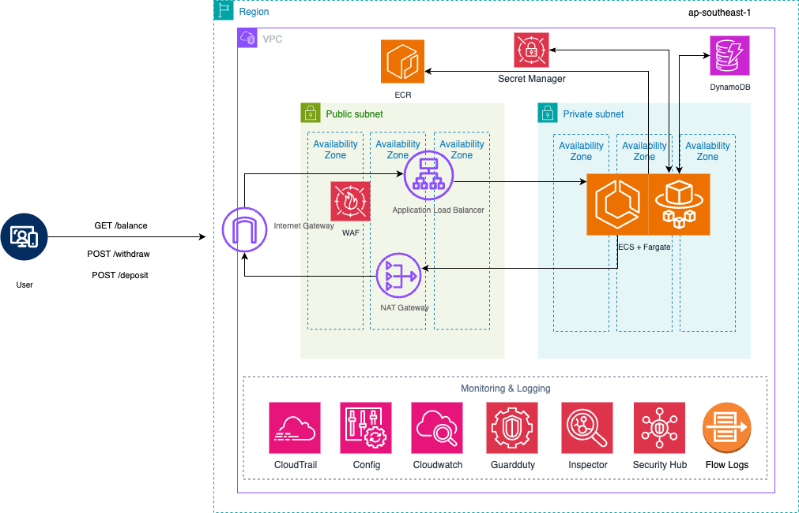

# GIC Banking Application

## Table of Contents
- [Background](#background)
- [Implementation Overview](#Implementation Overview)
- [High-level architecture](#architecture)
- [Limitations](#limitations)
- [Future Enhancements](#enhancements)

## Background
This assignment focuses on designing and implementing a cloud infrastructure for a banking application. The application provides support and efficient CRUD operations on a banking account.

The customer must be able to access the bank account operations via three endpoints,

* GET endpoint to get the current balance of an account.
* POST endpoint to deposit money to an account.
* POST endpoint to withdraw money from an account.

## Implementation Overview
For this assignment the infrastructure is provisioned via Terraform and deployed through Github pipeline. 

Likewise, the web application has been implemented and deployed via a different Github pipeline.

There are two Github workflows,
1.	Infrastructure workflow
2.	Web application workflow

The setup was separated into two Github workflows to improve manageability and maintenance.

The next section will discuss the high-level architecture.

## High-level architecture

  <strong>Figure 1:</strong> Cloud infrastructure architecture of the banking application.

This application is deployed in ap-southeast-1 region.

According to the above ***Figure 1***, the User will be accessing the endpoints to access banking application from public internet. User is authenticated before sending the request. Authentication will be handled by Secrets Manager.  Afterwards, the request will traverse to the VPC via Internet Gateway. There are two subnets inside the VPC,
* Public Subnet
* Private Subnet

Only the public subnet have the access to the public internet. Three availability zones have been setup to improve high availability by adhering to the design best practices mentioned in AWS Well Architected Framework. 

Inside the public subnet we have created Application Load Balancer(ALB) to route the traffic to the private subnet which the web application is deployed. Without the Load Balancer the user request would not traverse to the application.

Private Subnet will consist of 3 AZs for high availability and host the web application inside ECS Cluster with Fargate. ECS with Fargate was selected after considering cost and resiliency according to the AWS Well architected Framework.   For high availability at any given time two instances of ECS tasks will be running on the ECS cluster.

Traffic flown via ALB will be routed to ECS cluster. The artifacts to be deployed has already been deployed in Elastic Container Registry(ECR) via the Github CI/CD pipeline. When ECS is triggered it will download the artifacts in ECR and deploy the tasks.

For the web application residing inside the ECS needs information about bank accounts, that is stored in Accounts table in DynamoDB(DDB).  When endpoints hit the web application, based on the request it will retrieve or update the table in the DDB.

All the data at rest and transit has been encrypted via AWS managed Keys and AWS network.

All the information will be monitored and logged across the below services,
* CloudTrail  - Logs all the calls and events performed across AWS services
* Config -  Tracks configuration changes done by stakeholders
* Cloudwatch – Collects logs, metrics and events of resources
* Guard duty – Detect unauthorized activity
* Inspector – Scans software vulnerabilities and misconfigurations
* Security Hub – Aggregates findings from Guard duty, Inspector and shows findings against CIS, PCI DSS, ISO 27001 frameworks
* VPC Flow logs – Captures IP traffic data from/to network interfaces

## Limitations
1.	This web application is only deployed to Development environment only.
2.  Currently, application does not support HTTPS workloads.
3.  Managed Github runners have been used. Therefore, cannot force to install specific packages which will fix the security scan vulnerabilities in trivy. 
    Due to this reason we have ignored the trivy scan violations in the web-app pipeline.

## Future Improvements
1.	Upgrade authentication and authorization for the web application using Cognito or OIDC
2.	Add HTTPS for the ALB for secure traffic
3.	Analyse the possibility of moving the endpoints to API Gateway
4.	Multi-environment deployment
5.  Fix the security scans and vulnerabilities once Github runners setup.
6.  Dynamically rotate Secrets in Secret Manager

 

